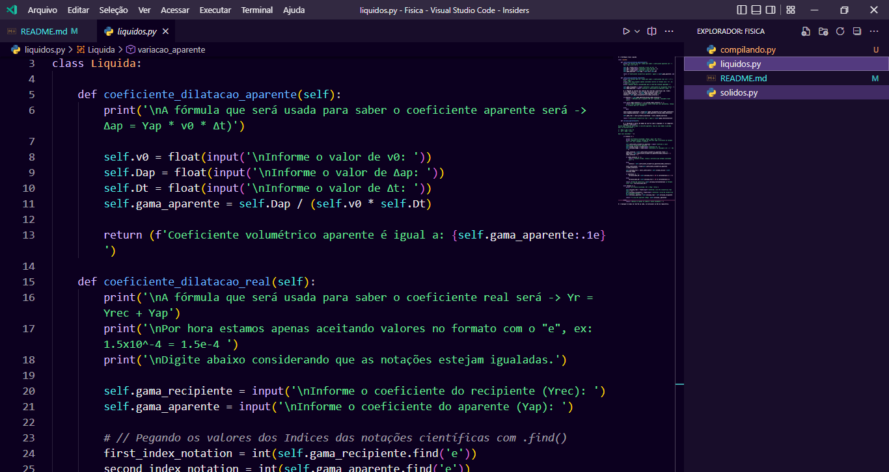

# Fisica 🌠

[](https://github.com/SmokeDevL/Fisica)
[](https://github.com/SmokeDevL/Fisica)

> Um código em python que faz cálculos 🧮´

O programa foi desenvolvido por [Carlos](https://github.com/SmokeDevL) teve a idéia a partir de um projeto escolar.



<a href="https://open.spotify.com/playlist/4f7Dblb3Wxhg7bOl5HAPua?si=45f83ff4ee724fb8" style="display:inline-block; background:#67E591; color:#0C001F; padding:20px; font-weight:bold;">
Escute a minha playlist que eu escutava enquanto programava 🎧
</a>

## Importando

1. Dê **Fork** no arquivo das classes.
1. Copie ou baixe o arquivo contendo os `Códigos`.
1. Deixe a classe em um arquivo **Separado**.
1. Em baixo está um exemplo de como **Importar**.
```python
from liquidos import Liquida
```

## Sobre o código

Existem vários **Métodos** e **Atributos** nas classes que você deveria saber.

### Métodos

* `coeficiente_dilatacao_aparente()` Essa função logo que chamada não precisa de parâmetros e irá retornar o valor do Yap, F = *(Δap = Yap * v0 * Δt)*.
* `coeficiente_dilatacao_real()` Nome do método que também não precisa de parâmetros, mas irá retornar o valor do Yr, F = *(Yr = Yrec + Yap)*.
* `variacao_aparente()` Assim como as outras sem parâmetros, e retorna o resultado da variação aparente, F = *(ΔVap = yap * v0 * Δt)*.

* [Ler mais sobre as fórmulas](https://www.infoescola.com/termodinamica/dilatacao-dos-liquidos/)

### Atributos

* `self.v0` Atributo corresponde ao **valor inicial**.
* `self.Dap` Representa a **variação** ou **dilatação aparente**.
* `self.Dt` Atributo correspondente ao **valor da variação de temperatura**.

## Contribua

Sinta-se a vontadade para [file issues](https://github.com/SmokeDevL/Fisica/issues), [submit PRs](https://github.com/SmokeDevL/Fisica/pulls) pra esse repositório, ou tente criar o seu própio a partir dessse.

## Obrigado

Eu começei esse projeto sozinho e os conhecimento aplicados aprendido com o professor [Leonardo](https://classroom.google.com/u/1/c/NTA2ODYyNDMxNjA5)